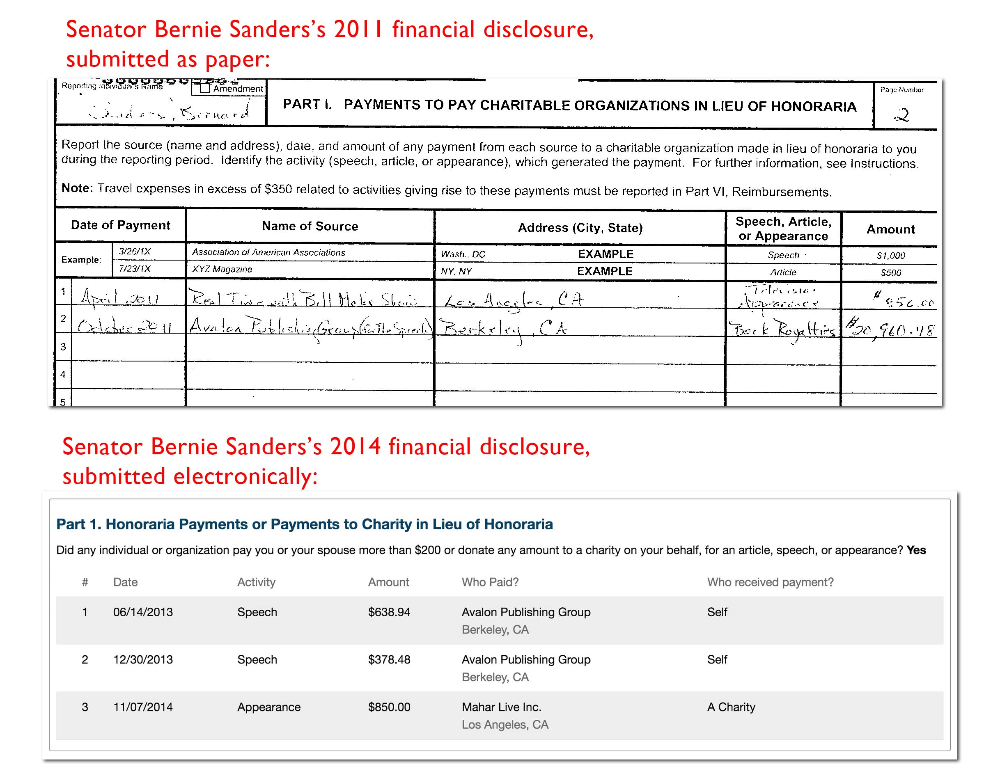
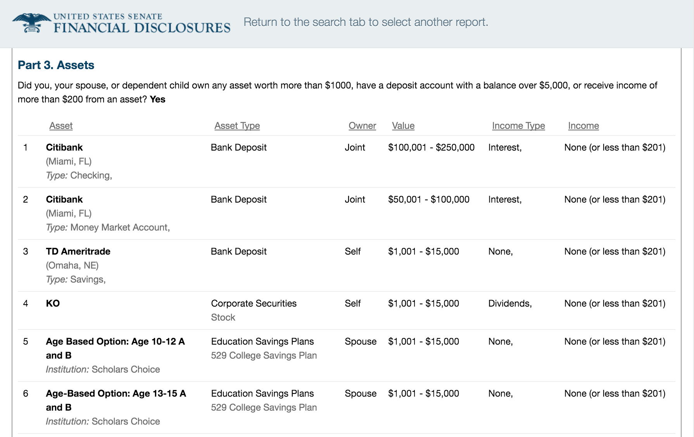
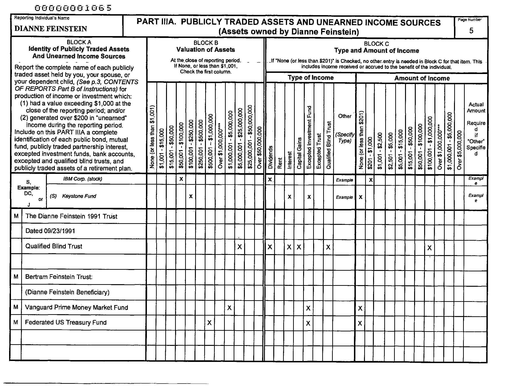
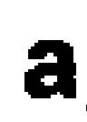
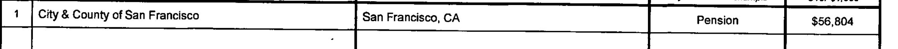
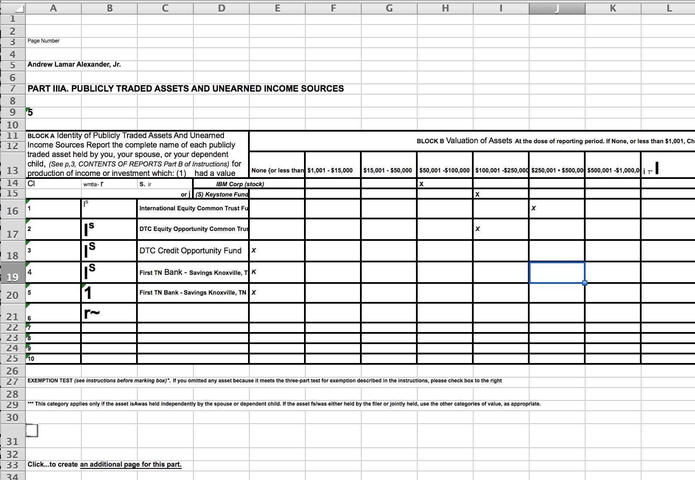
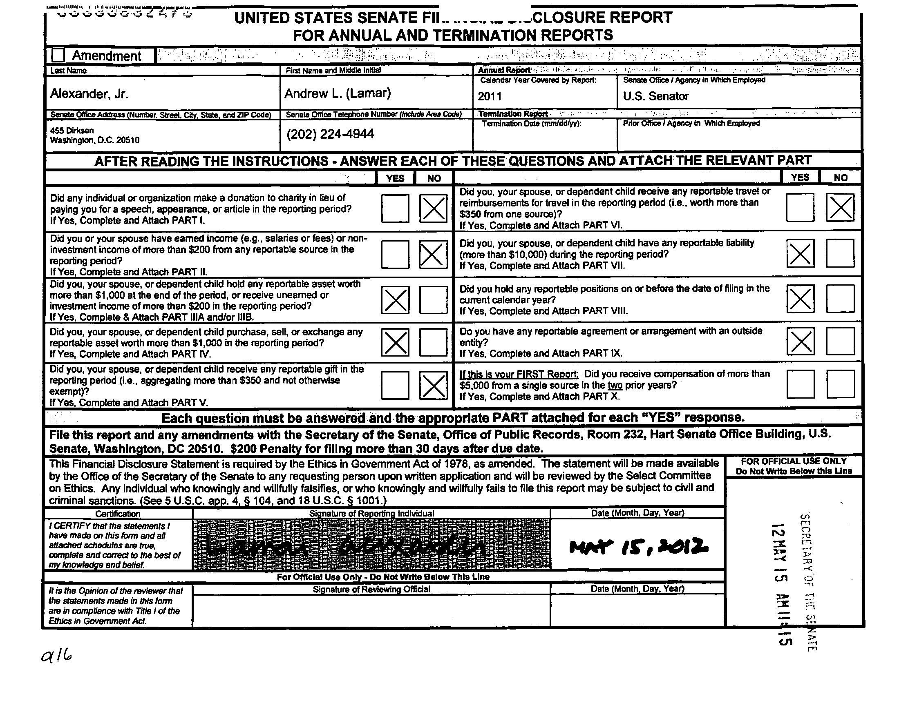
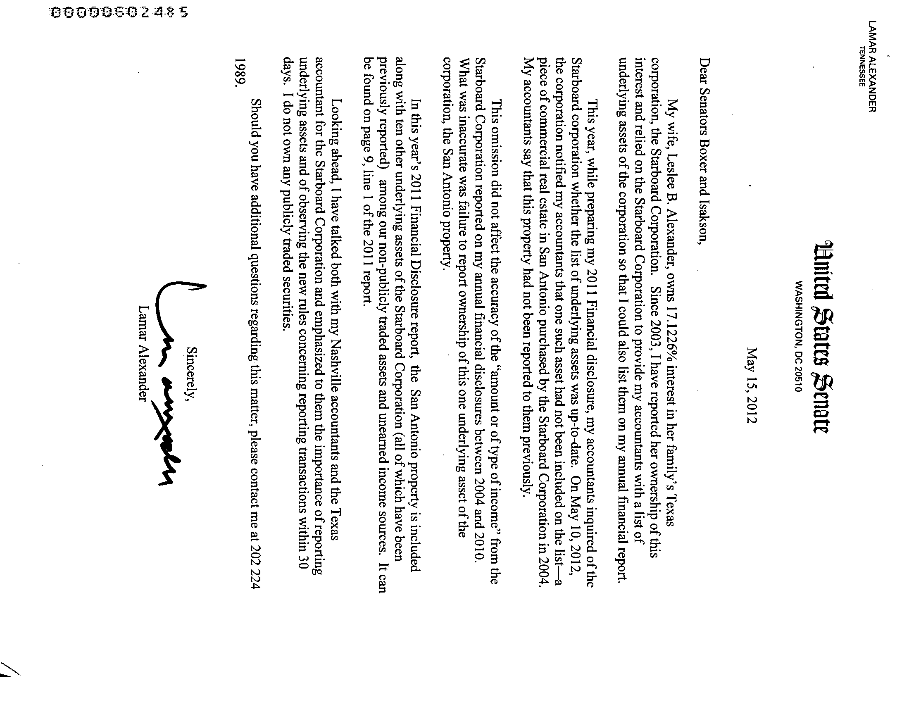

# Using ABBYY FineReader to extract tabular data from U.S. Senators' personal finance reports

Members of Congress are required to submit regular reports detailing their personal wealth. However, despite the [existence of electronic filing systems](http://www.rollcall.com/moneyline/senate-enters-electronic-age-with-personal-wealth-disclosures/), some legislators still submit via paper, which is then scanned and uploaded as images or PDFs into an online database ([Senate](https://efdsearch.senate.gov/search/home/) / [House](http://clerk.house.gov/public_disc/financial-search.aspx)).

Extracting data from scanned images is one of the most common and most difficult data wrangling tasks, such that OpenSecrets (aka The Center for Responsive Politics) [pitched a civic hackathon challenge to build a solution for efficiently parsing Congressmembers' personal financial disclosures](https://github.com/pdfliberation/pdf-hackathon/blob/master/challenges/house-financial-disclosures.md#2nd-option---handwritten-reports).

My writeup here is meant as a quick overview of the effectiveness of using [ABBYY FineReader for Mac](http://www.abbyy.com/finereader/pro-for-mac/) in producing usable, perhaps even _delmited_ data from the scanned disclosure forms. Note that I'm not attempting to solve the problem of how to clean up the imperfect OCR results and insert them into a database, and how to automate it as a batch process. Just extracting text, even semi-accurately, from a single scanned form is a hard challenge on its own.

__My initial takeaway:__ FineReader is remarkably good for this task; in a later walkthrough I'll explain how to apply this in semi-automated fashion across all the forms (or any other set of scanned papers). 

For the purposes of brevity, this writeup focuses on the [Senate financial disclosures](https://efdsearch.senate.gov/search/home/) - the OCR challenge for both chambers of Congress is fundamentally the same.

## What the submitted financial disclosure forms look like

The Senate's financial disclosure database can be found [here](https://efdsearch.senate.gov/search/home/):

https://efdsearch.senate.gov/search/home/

If you want to visit the direct links I provide, you'll need to visit the [Senate site with your browser](https://efdsearch.senate.gov/search/home/) and manually agree to the site's terms of use. This will start a browser session that allows you to access the direct links.

### An electronically-submitted personal finance report

Here's what an annual report on personal finances for 2014 looks like when it's electronically-submitted, courtesy of [Senator Marco Rubio](https://www.opensecrets.org/pfds/reports.php?year=2014&cid=N00030612):

https://efdsearch.senate.gov/search/view/annual/de85e0d9-7eeb-49b6-83df-67affd2df645/

For your convenience, I've [mirrored the HTML for Sen. Rubio's financial report, which you can visit here](http://so.danwin.com/senate-ocr/2014-rubio-report.html) without going through the Senate site.

As you can see, the HTML is straightforward to parse as machine-readable data. So let's dispel once and for all with this fiction that Senator Rubio doesn't know what he's doing. He knows __exactly__ what he's doing.

### A personal finance report submitted as paper

And here's what that same report looks like when it's submitted on paper, courtesy of [Senator Dianne Feinstein](https://www.opensecrets.org/pfds/reports.php?cid=N00007364):

https://efdsearch.senate.gov/search/view/paper/B06D0983-3786-41CB-92C6-5209F288D517/

[OpenSecrets has a copy of the PDF](http://pfds.opensecrets.org/N00007364_2014.pdf) that you can view without visiting the Senate site. Here's what one of the scanned pages looks like:

# The OCR challenge

It's important to note that even though Senator Rubio's electronic form is easy to read, programmatically, there's still the challenge of creating a data schema that you can import his financial data into. 

That same challenge exists for Senator Feinstein's paper form, except with the additional and exponentially more challenging task of just extracting the data. This challenge is what necessitates the use of [__optical character recognition technology__](https://en.wikipedia.org/wiki/Optical_character_recognition), aka __OCR__. 

Here are my desired outcomes:

###### 1. Convert scanned English text characters into plaintext data

That is, convert a _picture_ of the letter  into a digital plaintext representation that can be read by a text editor: `a`

###### 2. Convert scanned data tables into Excel spreadsheet tables

That is, convert a _picture_ of a table of data:

Into something that can be read as delimited data values in a standard Excel spreadsheet:

|                                |                   |         |         |
|--------------------------------|-------------------|---------|---------|
| City & County of San Francisco | San Francisco, CA | Pension | $56,804 |

The process of turning images into string literals is extremely difficult, and doing it at [high rate accuracy is beyond most development shops smaller than Google](https://cloud.google.com/vision/). The additional challenge of seeing that the images represent _tabular data_ is of itself another, non-trivial challenge.

## Using ABBYY FineReader

There are open-source OCR programs, of which [Tesseract is the most well-known](https://github.com/tesseract-ocr), but they don't generally do the task of recognizing tabular data (note: [software such as Tabula](http://tabula.technology/) deals with _actual_ tabular data, not scanned images).  

Commercial packages -- such as [ABBYY's FineReader](http://www.abbyy.com/finereader/) and [OmniPage](http://www.nuance.com/for-business/by-product/omnipage/ultimate/index.htm) -- do claim to effectively OCR tabular data. I've never used either until now, but I'm using ABBYY's product because I've heard good things about it and because I don't make enough money to afford OmniPage.

I'm on a Mac so I only have access to [FineReader Pro for Mac](http://www.abbyy.com/finereader/pro-for-mac/), which is listed at $119. Windows users have access to [FineReader 12 Professional](http://www.abbyy.com/finereader/professional/) and [Corporate](http://www.abbyy.com/finereader/corporate/) -- and, I'm betting, more tech support and updates.

### ABBYY Cloud?

During the [OpenSecrets PDF hackathon](https://github.com/pdfliberation/pdf-hackathon/blob/master/challenges/house-financial-disclosures.md#2nd-option---handwritten-reports), developer Ross Tsiomenko [tested the idea of using ABBYY's cloud service](http://ocrsdk.com/) to batch process the Congressional forms](https://www.opengovfoundation.org/developers-blog-liberating-congressional-financial-disclosure-data-from-pdfs/):

> Financial Disclosure Reports are not text-based PDFs, but rather scanned-in images, meaning OCR (optical character recognition) software must be used to extract the data. ABBYY Cloud OCR is the only software currently known to extract tabular data correctly; the prototype uses a shell script to upload a PDF to the Cloud API, which returns a text file with most columns and rows intact. This is then cleaned up and turned into a csv file using Python.

> ...Once everything is working, an alternative to the paid ABBYY Cloud OCR service should be found. Although ABBYY works great, it is not free; processing all forms filed within a calendar year would take 10,000+ page requests (not counting development trial and error), which could cost up to $900 according to ABBYY pricing. 

I haven't used the cloud service and I agree that the cost is probably prohibitive for most projects. So for this writeup, I'm focusing only on the desktop application -- I imagine both the Windows and Mac versions have similar OCR effectiveness. I'll cover the process of how to use the Desktop application to perform batch OCR in another writeup.

## Simple table

The OCRing of text is well-known -- and I show how FineReader OCR compares to Tesseract OCR when it comes to a scanned cover letter [later in this writeup](#finereader-vs-tesseract).

So let's get right into interesting part: the OCR of tabular data. 

Here's one of the simpler variations of forms in the Senate disclosures:

Note: this example and others come from [Senator Lamar Alexander's](https://www.opensecrets.org/pfds/summary.php?cid=N00009888) 2011 Annual Report (mirrored [here](http://pfds.opensecrets.org/N00009888_2011.pdf) at OpenSecrets). The electronic system only [came into effect a couple years ago](http://www.rollcall.com/moneyline/senate-enters-electronic-age-with-personal-wealth-disclosures/) and Senator Alexander's [latest annual report was submitted electronically](https://efdsearch.senate.gov/search/view/annual/88f4fc2c-e599-44e9-a704-fbebd05f4207/), so good on him.

### What FineReader sees

When importing that single image into FineReader, this is what FineReader purports to "see", in terms of the OCRable regions of the page:

### The resulting Excel spreadsheet

FineReader has the ability to export the OCRed image as a PDF. But we want a __table__ -- i.e. an Excel spreadsheet.

And here's the result:

Pretty good! You can download the [Excel file here](xls/000602483.xlsx). Or, if you want, here's the [PDF](pdf/000602483.pdf) that FineReader produces, which includes the OCRed text that you can at least highlight-copy-paste.

## Less simple table

OK, now here's a much less simpler table:

Not only is there significantly more ink (and _smudged_ ink) to deal with, but there are vertical table headers and other complex tabular features to process.

Here's the result of FineReader's Excel output:

Definitely not as clean as the previous example, but to be honest, _much_ better than what I had expected. I'm kind of shocked that it managed to make sense of the __vertically__-oriented headers. You'd still have a long ways to go before you could put this into a database, but FineReader's output gives you a lot of options for heuristics to simplify the translation process.

And what if you just need to very quickly see if anyone at anytime has ever owned assets in "Acme Co."? At the very least, FineReader provides very greppable text data.

Here's the [Excel spreadsheet](xls/000602474.xlsx). And here's the [PDF](pdf/000602474.pdf) with embedded OCRed text.

## A bunch of checkboxes 

One more example: a bunch of checkboxes:

That can't be that hard, right? But take a closer look...among other issues, we have boxes inside of boxes. And also, a bunch of hand-written scrawl that we can safely assume will not be accurately parsed.

Here's what the spreadsheet produced by FineReader looks like:

Yep, that's basically unusable. You can download the [spreadsheet file here](xls/000602470.xlsx). And the [PDF with embeddable text here](pdf/000602470.pdf).

## Simple letter page (FineReader vs Tesseract)

What about regular letters of prose? This is something within the featureset of open-source OCR such as [Tesseract (I'm using 3.04.01, which was released in February)](https://github.com/tesseract-ocr/tesseract), so I'll compare it against FineReader.

Here's the original page from Sen. Alexander's report, with its original neck-wrenching-orientation

### FineReader + pdftotext -layout

Here's the [PDF created by FineReader's OCR](pdf/000602485.pdf), which is able to detect orientation automatically. Because we don't care about tabular data, I've used [Poppler's](https://poppler.freedesktop.org/) __pdftotext__ utility to just extract the text, along with pdftotext's `-layout` flag to produce it in such a way that the whitespace is similar to the visual layout of the PDF.

Not bad. There are a few problems that would be significant hurdles if you wanted to grep across the text, including a comma where a decimal point should be in `17.1226% interest`. And the somewhat inexplicably consistent translation of `of` to `o f`:

~~~
     LAMAR ALEXANDER
         TENNESSEE

                                              Mttd States Senate
                                                     WASHINGTON, DC 20510

                                                                 May 15,2012

           Dear Senators Boxer and Isakson,

                   My wife, Leslee B. Alexander, owns 17,1226% interest in her family’    s Texas
           corporation, the Starboard Corporation. Since 2003,1have reported her ownership o f this
           interest and relied on the Starboard Corporation to provide my accountants with a list o f
           underlying assets o f the corporation so that I could also list them on my annual financial report.

                   This year, while preparing my 2011 Financial disclosure, my accountants inquired o f the
           Starboard corporation whether the list o f underlying assets was up-to-date. On May 10, 2012,
           the corporation notified my accountants that one such asset had not been included on the list— a
           piece o f commercial real estate in San Antonio purchased by the Starboard Corporation in 2004.
           My accountants say that this property had not been reported to them previously.

                  This omission did not affect the accuracy o f the “
                                                                    amount or o f type o f income”from the
           Starboard Corporation reported on my annual financial disclosures between 2004 and 2010.
           What was inaccurate was failure to report ownership o f this one underlying asset o f the
           corporation, the San Antonio property.

                  In this year’s 2011 Financial Disclosure report, the San Antonio property is included
           along with ten other underlying assets o f the Starboard Corporation (all o f which have been
           previously reported) among our non-publicly traded assets and unearned income sources. It can
           be found on page 9, line 1 o f the 2011 report.

                  Looking ahead, I have talked both with my Nashville accountants and the Texas
           accountant for the Starboard Corporation and emphasized to them the importance o f reporting
           underlying assets and o f observing the new rules concerning reporting transactions within 30
           days. I do not own any publicly traded securities.

                     Should you have additional questions regarding this matter, please contact me at 202 224
            1989.

                                                                 Sim
                                                                 Sincerely,
$0
ST
iN                                                       Lamar Alexander
©
io
o
D
P
P
O

~~~

### Tesseract OCR

For this test, I used Tesseract [version 3.04.01](https://github.com/tesseract-ocr/tesseract/releases/tag/3.04.01), which was released in February 2016. One of the things Tesseract _won't_ do is process GIFs (which is, for whatever reason, the preferred image format of the Senate disclosure database), so you'll need something like ImageMagick. 

And, Tesseract doesn't seem to do automatic orientation detection (or at least I don't know how to invoke it), so you'll have to reorient the image before passing it to Tesseract to OCR.

The command-line sequence with ImageMagick looks like this:

~~~sh
$ convert 000602485.gif -rotate 270 000602485.tiff
$ tesseract 000602485.tiff 000602485-tesseract
~~~

And produces a file named [000602485-tesseract.txt](txt/000602485-tesseract.txt). Because Tesseract by default produces a plaintext stream, there is no option to use `pdftotext -layout` on its output (you can, however, configure Tesseract to output HOCR data, which gives you the option of manually determining spatial regions for yourself, which projects [like Jacob Fenton's whatwordwhere aim to do](https://github.com/jsfenfen/whatwordwhere)).

Here's the text output from Tesseract:

~~~
LAMAR ALEXANDER
TENNESSEE

flflnittd 0%tatts :52an

WASHINGTON, DC 20510
May 15, 2012

Dear Senators Boxer and Isakson,

My wife, Leslee B. Alexander, owns 17.1226% interest in her family’s Texas
corporation, the Starboard Corporation. Since 2003, I have reported her ownership of this
interest and relied on the Starboard Corporation to provide my accountants with a list of
underlying assets of the corporation so that I could also list them on my annual financial report.

This year, while preparing my 201 1 Financial disclosure, my accountants inquired of the
Starboard corporation whether the list of underlying assets was up-to-date. On May 10, 2012,
the corporation notified my accountants that one such asset had not been included on the list—a
piece of commercial real estate in San Antonio purchased by the Starboard Corporation in 2004.
My accountants say that this property had not been reported to them previously.

This omission did not affect the accuracy of the “amount or of type of income” from the
Starboard Corporation reported on my annual financial disclosures between 2004 and 2010.
What was inaccurate was failure to report ownership of this one underlying asset of the
corporation, the San Antonio property.

In this year’s 2011 Financial Disclosure report, the San Antonio property is included
along with ten other underlying assets of the Starboard Corporation (all of which have been
previously reported) among our non-publicly traded assets and unearned income sources. It can
be found on page 9, line 1 of the 2011 report.

Looking ahead, I have talked both with my Nashville accountants and the Texas
accountant for the Starboard Corporation and emphasized to them the importance of reporting
underlying assets and of observing the new rules concerning reporting transactions within 30
days. I do not own any publicly traded securities.

Should you have additional questions regarding this matter, please contact me at 202 224
1989.

m Sincerely,
ST
N , Lamar Alexander

Ll?
CD!

(5:)
G)
~~~

For being free, Tesseract does a very capable job. I didn't bother to do a real analysis of its accuracy versus FineReader, though, other than to note that it correctly interpreted `of` as `of`.

# Conclusion

Turning data that was "optimized" for paper -- whether [it be digital PDFs](https://www.propublica.org/nerds/item/heart-of-nerd-darkness-why-dollars-for-docs-was-so-difficult) or [scanned images simply packaged as PDFs](https://www.propublica.org/series/free-the-files) -- will be a significant computational task as long as humans require human-readable information. And it's safe to assume that state-of-the-art OCR will never be 100% accurate.

For now, I'm pretty satisfied with the kind of performance FineReader provides at ~$100 -- and I don't blame the open-source contributors of Tesseract if they aren't able to voluntarily tackle the challenge of OCRing tabular data -- Tesseract (which is also trainable) works pretty damn well on regular text.

In terms of [OpenSecrets's call-to-arms to automate the processing of Congressional paper forms](https://github.com/pdfliberation/pdf-hackathon/blob/master/challenges/house-financial-disclosures.md#2nd-option---handwritten-reports), good OCR is not enough, we need a system to batch collect and process the documents, which will be its own writeup.

It's worth noting, though, that OpenSecrets isn't waiting around for magic OCR to come around: they've processed the financial disclosure forms the old-fashioned way -- human-powered reading and data entry -- and have generously provided their results in browsable and searchable form on the [Personal Finances](https://www.opensecrets.org/pfds/) section of their eponymous political transparency site:

https://www.opensecrets.org/pfds/

