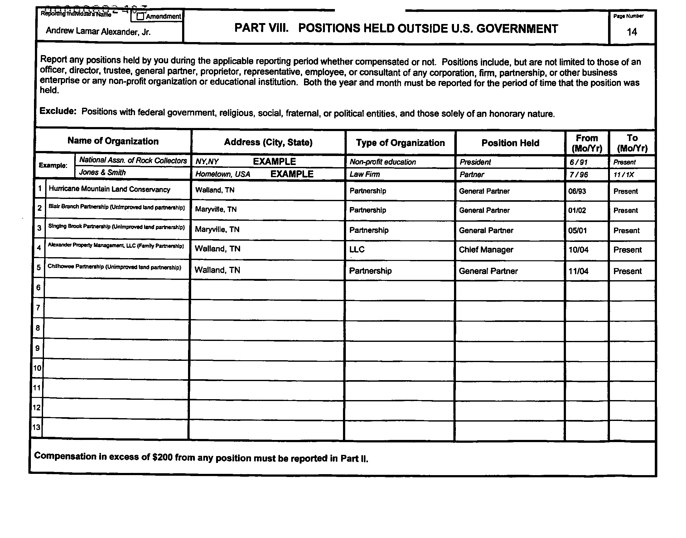
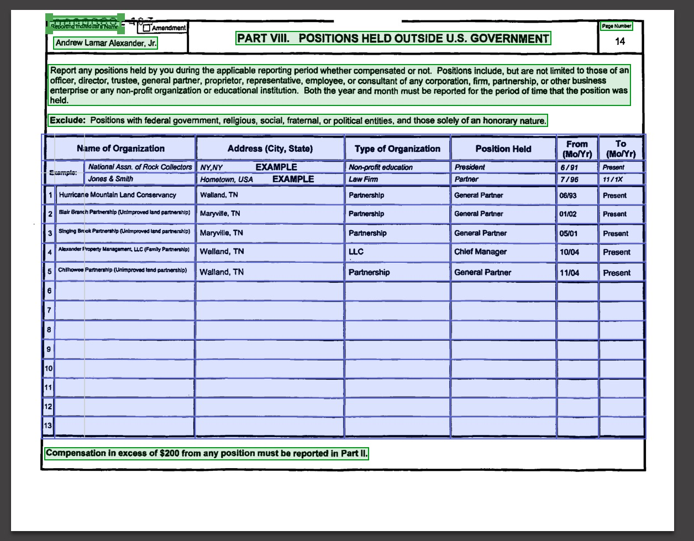
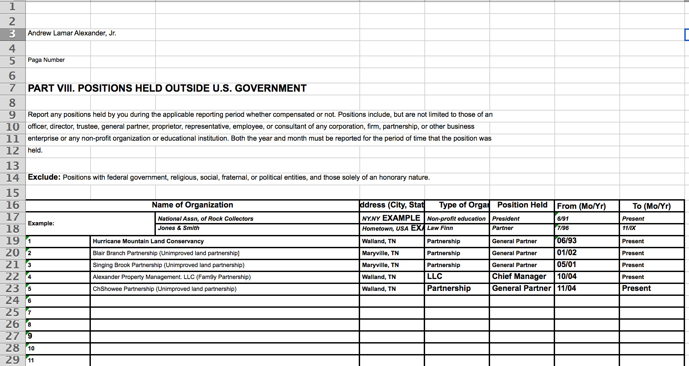

# ABBYY FineReader OCR performance in regards to Senate financial disclosure documents.

(draft)

The document can be found here on the Senate site -- however, it requires visiting the site via browser to accept terms and conditions to initiate a session: https://efdsearch.senate.gov/search/view/paper/2701724B-A03B-4738-8E28-15D9FBBADEFE/

OpenSecrets PFD project has the report archived here:

http://pfds.opensecrets.org/N00009888_2011.pdf

Here's all of the reports they have for Sen. Alexander:

https://www.opensecrets.org/pfds/reports.php?cid=N00009888

## Previous work

### PDF Liberation Hackathon - House of Representative Personal Financial Disclosures

https://github.com/pdfliberation/pdf-hackathon/blob/master/challenges/house-financial-disclosures.md

> **Background and Challenge**
>
> Members of the House of Representatives submit a yearly report on their personal finances. Though this report is often submitted electronically, it is only made available in PDF form on the Clerk of the House's website. The challenge is to find a reliable and sustainable way to extract the information entered on the form, to define the grid, and to OCR each piece of entered information. This is especially challenging because the form shifts with downloads and content.

### Using ABBYY cloud

https://www.opengovfoundation.org/developers-blog-liberating-congressional-financial-disclosure-data-from-pdfs/

> Financial Disclosure Reports are not text-based PDFs, but rather scanned-in images, meaning OCR (optical character recognition) software must be used to extract the data. ABBYY Cloud OCR is the only software currently known to extract tabular data correctly; the prototype uses a shell script to upload a PDF to the Cloud API, which returns a text file with most columns and rows intact. This is then cleaned up and turned into a csv file using Python.

> ...Once everything is working, an alternative to the paid ABBYY Cloud OCR service should be found. Although ABBYY works great, it is not free; processing all forms filed within a calendar year would take 10,000+ page requests (not counting development trial and error), which could cost up to $900 according to ABBYY pricing. 

## Simple table

### What ABBYY sees

### The resulting Excel spreadsheet

## Simple letter page

What about plain prose letters?

Here's the original page from Sen. Alexander's report, with its original neck-wrenching-orientation

### Comparison with Tesseract

How does FineReader compare to the [open-source Tesseract OCR project](https://github.com/tesseract-ocr/tesseract)? 

### FineReader + pdftotext -layout

Here's the PDF created by FineReader's OCR, which is able to detect orientation automatically:

And here's the result using [Poppler's](https://poppler.freedesktop.org/) `pdftotext -layout` to extract the text:

~~~
     LAMAR ALEXANDER
         TENNESSEE

                                              Mttd States Senate
                                                     WASHINGTON, DC 20510

                                                                 May 15,2012

           Dear Senators Boxer and Isakson,

                   My wife, Leslee B. Alexander, owns 17,1226% interest in her family’    s Texas
           corporation, the Starboard Corporation. Since 2003,1have reported her ownership o f this
           interest and relied on the Starboard Corporation to provide my accountants with a list o f
           underlying assets o f the corporation so that I could also list them on my annual financial report.

                   This year, while preparing my 2011 Financial disclosure, my accountants inquired o f the
           Starboard corporation whether the list o f underlying assets was up-to-date. On May 10, 2012,
           the corporation notified my accountants that one such asset had not been included on the list— a
           piece o f commercial real estate in San Antonio purchased by the Starboard Corporation in 2004.
           My accountants say that this property had not been reported to them previously.

                  This omission did not affect the accuracy o f the “
                                                                    amount or o f type o f income”from the
           Starboard Corporation reported on my annual financial disclosures between 2004 and 2010.
           What was inaccurate was failure to report ownership o f this one underlying asset o f the
           corporation, the San Antonio property.

                  In this year’s 2011 Financial Disclosure report, the San Antonio property is included
           along with ten other underlying assets o f the Starboard Corporation (all o f which have been
           previously reported) among our non-publicly traded assets and unearned income sources. It can
           be found on page 9, line 1 o f the 2011 report.

                  Looking ahead, I have talked both with my Nashville accountants and the Texas
           accountant for the Starboard Corporation and emphasized to them the importance o f reporting
           underlying assets and o f observing the new rules concerning reporting transactions within 30
           days. I do not own any publicly traded securities.

                     Should you have additional questions regarding this matter, please contact me at 202 224
            1989.

                                                                 Sim
                                                                 Sincerely,
$0
ST
iN                                                       Lamar Alexander
©
io
o
D
P
P
O

~~~

### Tesseract OCR

For this test, I used Tesseract [version 3.04.01](https://github.com/tesseract-ocr/tesseract/releases/tag/3.04.01), which was released in February 2016.

I had to manually re-orient the page 270 degrees for Tesseract to work. Tesseract just extracts plaintext, so there is no option to use `pdftotext -layout` on its output:

~~~
LAMAR ALEXANDER
TENNESSEE

flflnittd 0%tatts :52an

WASHINGTON, DC 20510
May 15, 2012

Dear Senators Boxer and Isakson,

My wife, Leslee B. Alexander, owns 17.1226% interest in her family’s Texas
corporation, the Starboard Corporation. Since 2003, I have reported her ownership of this
interest and relied on the Starboard Corporation to provide my accountants with a list of
underlying assets of the corporation so that I could also list them on my annual financial report.

This year, while preparing my 201 1 Financial disclosure, my accountants inquired of the
Starboard corporation whether the list of underlying assets was up-to-date. On May 10, 2012,
the corporation notified my accountants that one such asset had not been included on the list—a
piece of commercial real estate in San Antonio purchased by the Starboard Corporation in 2004.
My accountants say that this property had not been reported to them previously.

This omission did not affect the accuracy of the “amount or of type of income” from the
Starboard Corporation reported on my annual financial disclosures between 2004 and 2010.
What was inaccurate was failure to report ownership of this one underlying asset of the
corporation, the San Antonio property.

In this year’s 2011 Financial Disclosure report, the San Antonio property is included
along with ten other underlying assets of the Starboard Corporation (all of which have been
previously reported) among our non-publicly traded assets and unearned income sources. It can
be found on page 9, line 1 of the 2011 report.

Looking ahead, I have talked both with my Nashville accountants and the Texas
accountant for the Starboard Corporation and emphasized to them the importance of reporting
underlying assets and of observing the new rules concerning reporting transactions within 30
days. I do not own any publicly traded securities.

Should you have additional questions regarding this matter, please contact me at 202 224
1989.

m Sincerely,
ST
N , Lamar Alexander

Ll?
CD!

(5:)
G)
~~~
